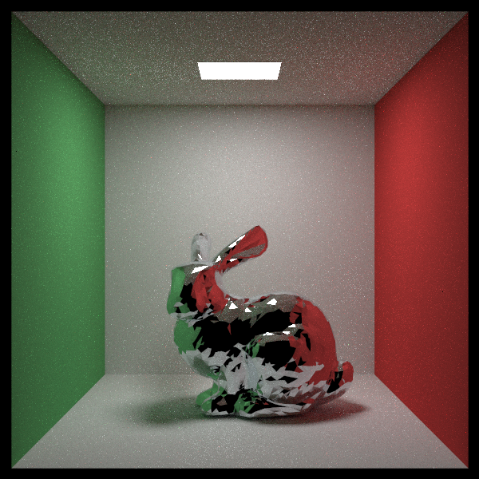

# CMU 15-618 Fall 2024 Course Project - Ray Tracing

#### Jiaqi Song (<jiaqison@andrew.cmu.edu>), Xinping Luo (<xinpingl@andrew.cmu.edu>)

We use the CPU start code from [Ray Tracing in One Weekend series](https://raytracing.github.io/). In addition to the basic features of the three books, we have incorporated support for triangles and meshes, as well as animations for moving cameras and moving objects. We plan to use BVH, OpenMP and CUDA to accelerate the rendering process. Our project website: [Ray Tracing in CUDA](https://raytracingcuda.github.io/).

## Check List

### CPU Renderer

- [x] Basic setup on CPU
- [x] Benchmark test case
- [x] Shared image data address
- [x] Use OpenMP and BVH to accelerate
- [x] Animation
- [x] Triangle and Mesh

### CUDA Renderer

- [x] Basic setup on CUDA 
- [x] Texture mapping on CUDA
- [x] Benchmark test case
- [x] Monte Carlo sampling on CUDA 
- [x] BVH acceleration on CUDA 
- [x] Animation on CUDA
- [x] Triangle and Mesh on CUDA

## Compile and run the ray tracer (modify the parameters in the script)

```bash
bash render.sh
```

## Reference output image

### First Scene Animation (rotate)


### First Scene Animation (translate)


### First Scene Animation (bounce sphere)


### First Scene


### Cornell Box


### Final Scene


### Mesh Scene

