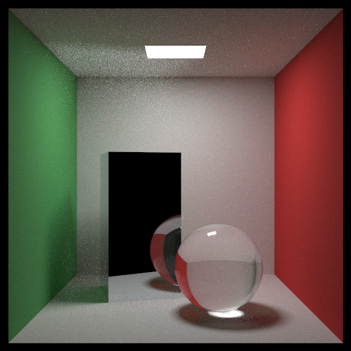
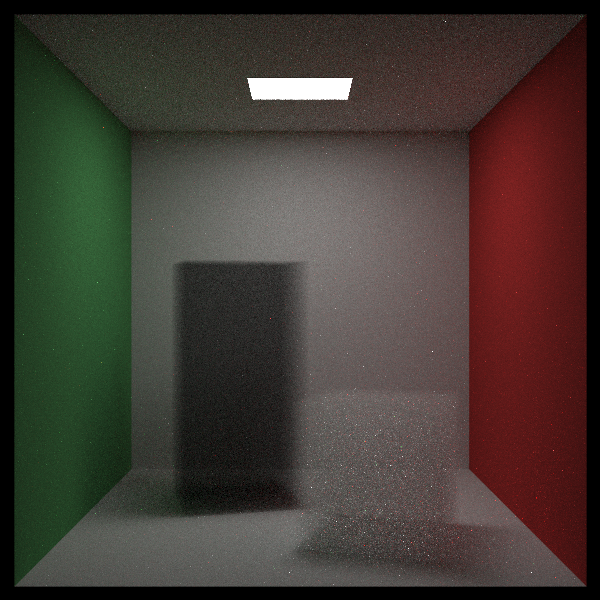
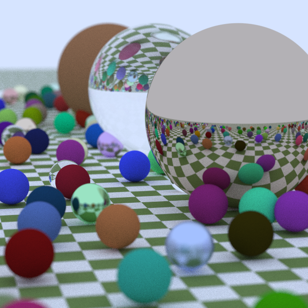
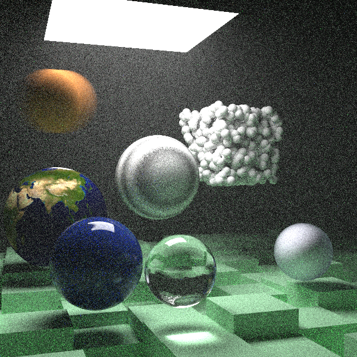

# CMU 15-618 Fall 2024 Course Project - Ray Tracing

#### Jiaqi Song (<jiaqison@andrew.cmu.edu>), Xinping Luo (<xinpingl@andrew.cmu.edu>)

## TODO List

### CPU Renderer

- [x] Basic setup in CPU
- [x] Benchmark test case
- [x] Shared image data address
- [x] OpenMP acceleration support
- [ ] Further optimization and acceleration on CPU
- [ ] Custum scene design
- [ ] Display and animation

### CUDA Renderer

- [ ] Basic setup in CUDA 
- [ ] Benchmark test case
- [ ] Further optimization and acceleration on GPU

## Reference output image

### Cornell Box

### Cornell Smoke

### First Scene

### Final scene
